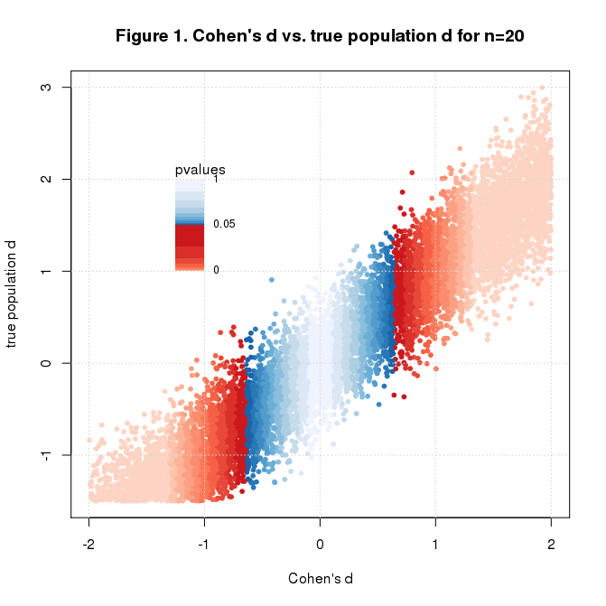
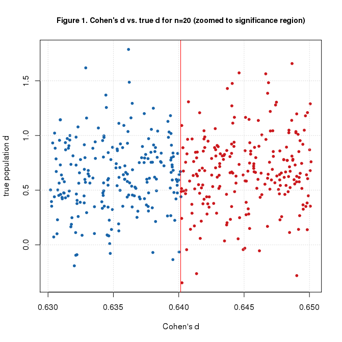
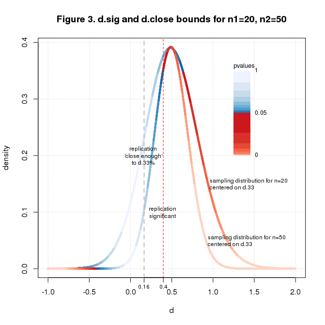
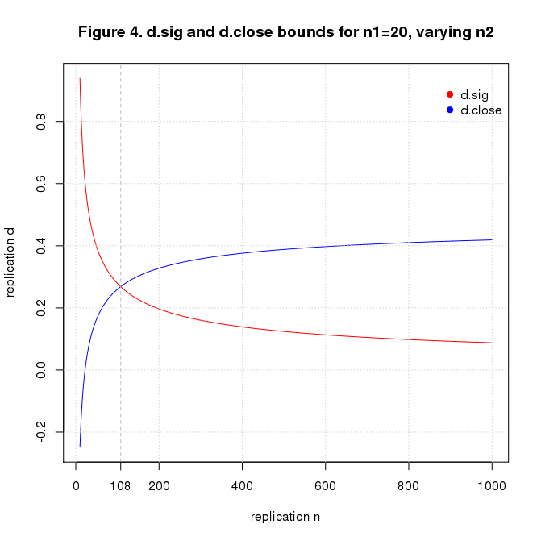

Replication Power
================
Nathan (Nat) Goodman
December 19, 2017

<!-- README.md is generated from README.Rmd. Please edit that file -->
*A collection of R scripts (and someday short articles) exploring replication power, which we define broadly as techniques for replicating scientific studies. The only content at present is a script that builds on Uri Simonsohn's Small Telescopes paper and related blog posts. The main finding is that if an initial study is too small, it not only limits the effect size that it can see but also the effect size that will ever be deemed a successful replication.*

Overview
--------

The `scope.R` script reimplements the replication idea in Uri Simonsohn's great paper [Small Telescopes: Detectability and the Evaluation of Replication Results](http://datacolada.org/wp-content/uploads/2015/05/Small-Telescopes-Published.pdf) and related blog posts [Accepting the NULL](http://datacolada.org/42), [How to evaluate replications](http://datacolada.org/47), and [The 90x75x50 heuristic: Noisy & Wasteful Sample Sizes In The 'Social Science Replication Project'](http://datacolada.org/54). The script explores some consequences of the strategy and finds that a too-small initial "small telescope" has lasting effects, limiting the effect size that will ever be deemed a successful replication.

Installation and Usage
----------------------

The simplest way to get the software is to download the script [`scope.R`](https://github.com/natgoodman/repwr/blob/master/R/scope.R) from the R subdirectory of the repository. The script uses base R capabilities only and will run "out of the box" on any (reasonably modern) R installation.

The recommended way to run the script is to `source` it into your R session and run the statement `run();` as shown below.

``` r
## This code block assumes your working directory is the root of the distribution.

source('R/scope.R');
run();
```

This runs the program with default parameters producing four graphs similar to the ones below. The default computation performs 10<sup>5</sup> simulations (taking about a minute on my small Linux server).



The user can change simulation and analysis parameters and control program operation by providing new values to `run()` as illustrated in the code block below. See the `init` function for details.

``` r
## this code block assumes your working directory is the root of the repository

source('script/scope.R');

## run default process and save simulations and results in directories data/scope and figure/scope
run(save=T);

## subsequent runs load simulation saved above. set save=F to avoid resaving it
run(save=F);

## change sample size
run(n=100);
```

See Also
--------

**NOT YET AVAILABLE** The article discussing the results is available in [html](https://natgoodman.github.io/repwr/scope.html) and [pdf](https://natgoodman.github.io/repwr/scope.pdf) formats on the [GitHub Pages site](https://natgoodman.github.io/repwr) associated with this repository. It's also in the repository as files [scope.html](scope.html) and [scope.pdf](scope.pdf). (But note that GitHub, unlike GitHub Pages, renders html files as raw text).

Author
------

Nathan (Nat) Goodman, (natg at shore.net)

Bugs and Caveats
----------------

Please report any bugs, other problems, and feature requests using the [GitHub Issue Tracker](https://github.com/natgoodman/repwr/issues). I will be notified, and you'll be apprised of progress.

Copyright & License
-------------------

Copyright (c) 2017 Nathan Goodman

The software is **open source and free**, released under the [MIT License](https://opensource.org/licenses/MIT). The documentation is **open access**, released under the [Creative Commons Attribution 4.0 International License](https://creativecommons.org/licenses/by/4.0).
