*Replication seems a sensible way to assess whether a scientific result is right. The intuition is clear: if a result is right, you should get a similar answer when repeating the work; if it it's wrong, your answer should be quite different. Statisticians have devised numerous statistical tests for deciding whether a replication passes or fails thus validating of refuting the original result. I simulate many of these tests across a range of conditions. For exact replications, simple significance testing works fine as a validation test, but when replicas diverge from the original studies no test works well. Much of the replication literature focuses, perhaps unwittingly, on methods for testing whether the studies are similar; these tests work quite poorly under all conditions analyzed here. Many caveats apply, but if correct, my results bode ill for large, systematic replication efforts, which typically prioritize uniformity over fidelity to run lots of studies at reasonable cost.*

## Introduction

The basic replication rationale goes something like this: (1) many published papers are wrong; (2) this is a serious problem the community must fix; and (3) systematic replication is an effective solution. (In recent months, I've seen an uptick in pre-registration as another solution. That's a topic for another day.)  In this post, I focus on the third point and ask: viewed as a statistical test, how well does systematic replication work; how well does it tell the difference between valid and invalid results?

By "systematic replication" I mean projects like 
[Many Lab](https://osf.io/89vqh/),
[Reproducibility Project: Psychology (RPP)](https://osf.io/ezcuj/wiki/home),
[Experimental Economics Replication Project (EERP)](https://experimentaleconreplications.com), and
[Social Sciences Replication Project (SSRP)](http://www.socialsciencesreplicationproject.com)
that systematically select studies in a particular field and repeat them in a uniform fashion. The main publications for these projects are 
[Many Lab](https://econtent.hogrefe.com/doi/full/10.1027/1864-9335/a000178), 
[RPP](http://science.sciencemag.org/content/349/6251/aac4716),
[EERP](http://science.sciencemag.org/content/early/2016/03/02/science.aaf0918.full),
[SSRP](https://www.nature.com/articles/s41562-018-0399-z).

I consider a basic replication scheme in which each original study is repeated once. This is like [RPP](https://osf.io/ezcuj/wiki/home) and [EERP](https://experimentaleconreplications.com), but unlike [Many Lab](https://osf.io/89vqh/) as published which repeated each study 36 times and [SSRP](http://www.socialsciencesreplicationproject.com) which used a two-stage replication strategy. 
I imagine that the replicators are trying to closely match the original study (*direct replication*) while doing the replications in a uniform fashion for cost and logistical reasons.

Various authors have proposed tests for deciding whether a replication succeeds or fails. These include significance testing of the replica study, seeing whether the observed effect size of one study falls in the confidence or prediction interval of the other, checking whether the confidence or prediction intervals of the two studies overlap, significance testing of the studies combined via meta-analysis, and comparing the observed effect size of the replica study with a "small telescope" threshold derived from the smallest true effect size the original study could have plausibly detected. These tests answer different questions, but each is used by one or more authors to accept or reject replications.

I simulate these rules (and more) across many replication conditions and compute false positive and false negative rates across a range of conditions. The simulations vary the sample size from 10 to 1000 and true effect size from 0 to 1; in total, I simulate 14,641 conditions each with $10^4$ simulated replications, for a grand total of almost 150 million simulated instances.

A replication is *exact* if the two studies are sampling the same population and *near-exact* if the populations differ slightly. This is an obvious replication scenario. You have a study you think may be a false positive; to check it out, you repeat the study, typically with a larger sample size, taking care to ensure that the replica closely matches the original.

A replication is *inexact* if the two studies are sampling very different populations. This scenario seems disconnected from the goal of validating an existing study. Since the populations are different, there's no reason to expect the studies to get similar answers and little basis for declaring a study invalid if the replication fails. What motivates this scenario, I think, is *generalizability* not validity. You have a study that demonstrates an interesting effect in a limited setting and want to know whether it generalizes to other settings. Some authors call this *conceptual replication*; in meta-analysis, people use the term *study heterogeneity* for situations in which the study populations are very different.

Significance testing of the replica works fine as a validation test for exact and near-exact replications, but error rates increase rapidly as the populations diverge. All other tests have excessive error rates under all conditions I analyzed. All tests have unacceptable error rates when used to check whether the original and replica studies are similar.

Many caveats apply. Perhaps my correctness criteria are wrong or error thresholds too low. Maybe I'm testing the methods on unrealistic conditions. I assume throughout that all population effect sizes are equally likely within the range studied; in particular, I don't consider *publication bias* or the possibility that many results are expected to be false *a priori*. The ever-present danger of software bugs also lurks.

If correct, my results suggest that systematic replication projects should change goals or methods. Replication only works as a validation test when replicas closely match the original studies.  This is bad news for systematic replication efforts, which typically prioritize uniformity over fidelity to run lots of studies at reasonable cost. An alternative is to switch gears, give up on validation, and focus on generalizability.

The software supporting this post is open source in my [repwr GitHub repository](https://github.com/natgoodman/repwr).

## Literature

Here are the main papers and blog posts that led to this work.

- The Science paper by the Open Science Collaboration "Estimating the reproducibility of psychological science", [accessible here](http://science.sciencemag.org/content/349/6251/aac4716) **if you have a Science account**, Gilbert et al's [Comment](http://science.sciencemag.org/content/351/6277/1037.2.full), the authors' [Response](http://science.sciencemag.org/content/351/6277/1037.3.full), Uri Simonsohn's [blog post commenting on the paper and response](http://datacolada.org/47), and Daniel Lakens's [post on the response](http://daniellakens.blogspot.com/2016/03/the-statistical-conclusions-in-gilbert.html). You can get to this material from the  [Reproducibility Project: Psychology wiki](https://osf.io/ezcuj/wiki/home) hosted by [Open Science Framework](https://osf.io)
- The [Many Labs](https://econtent.hogrefe.com/doi/full/10.1027/1864-9335/a000178) paper by Klein and many others, the many [published comments](https://econtent.hogrefe.com/doi/pdf/10.1027/1864-9335/a000202), and Uri Simonsohn's [post](http://datacolada.org/63)
- Uri Simonsohn's [Small Telescopes](http://datacolada.org/wp-content/uploads/2015/05/Small-Telescopes-Published.pdf) paper, and posts on [evaluating replications](http://datacolada.org/47), [errors in evaluating replications](http://datacolada.org/7), [setting replication sample sizes](http://datacolada.org/54), [accepting the NULL](http://datacolada.org/42), [estimating effect size](http://datacolada.org/20), and [overestimating effect size](http://datacolada.org/4)
- Daniel Lakens's posts on [capture percentages](http://daniellakens.blogspot.com/2016/03/the-difference-between-confidence.html) and [cost/benefit analysis of replications](http://daniellakens.blogspot.com/2018/01/)
- Lebel et al's [A Guide to Evaluate Replications](https://osf.io/bku9j/)
- Anderson and Maxwell's paper on [replication goals](http://www.apa.org/pubs/journals/features/met-met0000051.pdf) and the [Replication Network blog post](https://replicationnetwork.com/2017/02/28/anderson-maxwell-theres-more-than-one-way-to-conduct-a-replication-study-six-in-fact/) commenting on the paper
- Papers on prediction intervals by [Patil, Peng, and Leek](https://www.ncbi.nlm.nih.gov/pmc/articles/PMC4968573/) and [Stanley and Spence](http://journals.plos.org/plosone/article?id=10.1371/journal.pone.0162874)
- Sabeti's [counterpoint](http://www.bostonglobe.com/ideas/2018/01/21/for-better-science-call-off-revolutionaries/8FFEmBAPCDW3IWYJwKF31L/story.html) in the Boston Globe
- Several articles from the _Sackler Colloquium on Improving the Reproducibility of Scientific Research_ [published in PNAS](http://www.pnas.org/content/115/11), notably Fanelli's [opinion piece](http://www.pnas.org/content/115/11/2628) and Shiffrin, Börner, and Stigler's [big picture view](http://www.pnas.org/content/115/11/2632)

Kind readers of an earlier version recommended these additional references.

- Buttliere's paper on [engineering better incentives ](https://www.frontiersin.org/articles/10.3389/fncom.2014.00082/full) to improve the quality of scientific publications
- LeBel's paper on [modeling replication efficiency](https://etiennelebel.com/documents/lbcl(2017,jpsp).pdf)
- Meehl's paper on [basic flaws in psychology research circa 1990](http://citeseerx.ist.psu.edu/viewdoc/download?doi=10.1.1.392.6447&rep=rep1&type=pdf)
- Fanelli's preprint presenting [a theoretical model of knowledge content](https://peerj.com/preprints/1968/)

David Colquhoun reminded me that it's important to take into account the prior probability that studies are true, a topic I explored in a [previous post](http://daniellakens.blogspot.nl/2017/10/science-wise-false-discovery-rate-does.html). Relevant papers by Colquhoun include his recent proposal to [supplement p-values with false positive risk](https://arxiv.org/abs/1802.04888) and [2014](http://rsos.royalsocietypublishing.org/content/1/3/140216) and [2017](http://rsos.royalsocietypublishing.org/content/4/12/171085) papers discussing why p-values don't tell you the probability that a result is a false positive. 

Please see my [incipient website](https://natgoodman.github.io/blog) for related blog posts and working papers including a [detailed description of the replication tests](https://natgoodman.github.io/repwr/mesr.stable.html).

## The Simulation 

The software first simulates *studies* across a range of conditions, then combines pairs of studies into *pairwise replications*, applies rules (called *measures*) for deciding which pairwise replications pass, summarizes the results as counts and pass rates, and finally computes true and false positive and negative rates for measures and conditions of interest.

The studies are simple two group comparisons parameterized by sample size $n$ and population effect size $d_{pop}$ ($d_{pop}\ge0$). For each study, I generate two groups of random numbers, each of size $n$.  One group, *group0*, comes from a standard normal distribution with $mean=0$; the other, *group1*, is standard normal with $mean=d_{pop}$. I then calculate basic statistics of interest, most notably the *standardized observed effect size*, $d_{sdz}$, aka *Cohen’s d*, as the mean of *group1* minus the mean of *group0* divided by the pooled standard deviation of the two groups. The software simulates many studies (default $10^4$) for each combination of $n$ and $d_{pop}$. 

When I need to be pedantic, I use the terms *study instance* for each individual study and *study set* for the ensemble of study instances for a given combination of $n$ and $d_{pop}$.

The program varies $n$ from 10 to 1000 and $d_{pop}$ from 0 to 1. When analyzing results, I interpolate to get values that weren't simulated directly.

To generate pairwise replications, I consider all (ordered) pairs of study sets. For each pair, the software permutes the instances of each study, then combines the instances row-by-row to get *pairwise replication instances*. It's often convenient to think of the first study of the pair as the *original* and the second as the *replica*. 

A *pairwise replication set* is the ensemble of pairwise replication instances for a given pair of study sets. Four variables parameterize each pairwise replication set: $n1$, $n2$, $d1_{pop}$, $d2_{pop}$. These are, naturally enough, the sample and population effect sizes for the two study sets. In meta-analysis, the situation where $d1_{pop} \ne d2_{pop}$ is called *study heterogeneity*.

After forming the pairwise replications, I apply the *measures*, i.e., rules for deciding which replications pass. Each measure takes a pairwise replication set as input and returns a vector of boolean values telling which instances pass or fail. The result is a boolean matrix whose rows represent instances and columns represent measures. 

This post focuses on eight measures that seem most important. These measures answer different questions but all appear in papers or posts as tests to accept or reject replications.

- *sig2*: the second study of the pair has a significant p-value
- *sigm*: the fixed effect meta-analysis of the studies has a significant p-value
- *d1.c2* (resp. *d2.c1*): $d1_{sdz}$ (resp. $d2_{sdz}$), the standardized observed effect size (aka *Cohen's d*) of the first (resp. second) study is in the confidence interval of the second (resp. first) study; my implementation of confidence intervals is based on Uri Simonsohn's [code](http://urisohn.com/sohn_files/BlogAppendix/Colada20.ConfidenceIntervalsForD.R) supporting this [post](http://datacolada.org/20)
- *d1.p2* (resp. *d2.p1*): $d1_{sdz}$ (resp. $d2_{sdz}$) is in the prediction interval of the second (resp. first) study; my implementation of prediction intervals adapts code from David Stanley's [predictionInterval package](https://cran.r-project.org/web/packages/predictionInterval) and [Spence and Stanley's paper](https://www.ncbi.nlm.nih.gov/pmc/articles/PMC5028066/)
- *c1.c2* (resp. *p1.p2*): the confidence (resp. prediction) intervals of the two studies overlap

All measures assume that the first study is significant (*sig1* in my notation) and the observed effect sizes of the two studies have the same sign (both positive or both negative). 

I briefly examine Uri Simonsohn's *small telescopes* method (*d2.scp1* in my notation) from his [paper](http://datacolada.org/wp-content/uploads/2015/05/Small-Telescopes-Published.pdf) and [post](http://datacolada.org/42). My implementation is based on Uri's [code](http://urisohn.com/sohn_files/BlogAppendix/Colada42/%5b42%5d%20-%20Accepting%20the%20Null%20-%20R%20-%20Reproducibility%20project%20small%20telescope%20vs%20bayesian%202015%2010%2026.R) supporting that post. *Small telescopes*, unlike the others, assumes that *sig2* holds. For this reason, it needs a separate analysis.

The software summarizes the results by counting the number of positive results for each measure, taking into account the assumptions in the preceding paragraphs, and then converts the counts into pass rates. The final step is to convert pass rates into true positive, false positive, true negative, and false negative rates. This requires a definition of *true* and *false* instances, which in turn requires an explicit statement as to which replication instances represent replications that should succeed vs. ones that should fail.

## Correctness Criteria

I found no concise, rigorous definition of replication correctness anywhere.  Many authors rely on some variant of "A replication should succeed if my method says so". It's impossible to define error rates with such circular definitions.

Replication researchers study two aspects of correctness.  

1. The most basic concern is that the original study is a false positive.
2. The other concern is that the observed effect sizes of the two studies are inconsistent with each other. This might mean that the population effect sizes are different or that one result is an outlier.

The first concern seems sensible (at least, as sensible as any other use of the null hypothesis testing framework). The second concern baffles me: if the two studies are sampling different populations or one is an outlier, why does this invalidate the first study?

I'm tempted to ignore the second concern, but most proposed replication methods address it.  Sadly, I'm stuck with it for purposes of this post.

Here are the precise technical definitions.

1. *non-zero*: a replication instance is *true* if $d1_{pop}\ne0$, i.e., the population effect size of the first study is non-zero
2. *same-effect*: a replication instance is *true* if $d1_{pop}=d2_{pop}$, i.e., both studies have the same population effect size; with *tolerance* $\epsilon$, a replication instance is *true* if $abs(d1_{pop}-d2_{pop})\le\epsilon$, i.e., the two population effect sizes differ by at most $\epsilon$

Note that these criteria depend only on the population effect sizes.  

## Nomenclature

I've already introduced most of my nomenclature.  Here is a concise reprise.

_Studies_

- *study instance* is a single simulated study
- $n$ is the sample size
- $d_{pop}$ is the population effect size
- $d_{sdz}$ is the standardized observed effect size (aka *Cohen’s d*)
- *study set* is the set of study instances for a given $n$ and $d_{pop}$

_Pairwise replications_

- *pairwise replication instance* (or simply *replication instance*) is an ordered pair of study instances
- *s1* and *s2* refer to the first and second study of the pair
- $n1$, $d1_{pop}$, $d1_{sdz}$ are the sample size, population effect size, and *Cohen’s d* of the first study
- $n2$, $d2_{pop}$, $d2_{sdz}$ are the sample size, population effect size, and *Cohen’s d* of the second study
- *pairwise replication set* (or simply *replication set*) is the set of replication instances for a given $n1$, $n2$, $d1_{pop}$, and $d2_{pop}$
- a replication instance or set is *exact* if $d1_{pop}=d2_{pop}$
- *true* and *false* refer to the answers given by correctness criteria when applied to replication instances
- *positive* and *negative* refer to the results of applying measures to replication instances
- *true positive*, *false positive*, *true negative*, and *false negative* combine the notions of true vs. false and positive vs. negative instance. For a given correctness criterion and measure
    - *true positive instance* is a replication instance for which the correctness criterion and measure both return true
    - *false positive instance* is an instance for which the correctness criterion is false, but the measure returns true
    - *true negative instance* is an instance for which the correctness criterion and measure both return false 
    - *false negative instance* is an instance for which the correctness criterion is true, but the measure returns false

_Correctness criteria_

- *non-zero* is *true* if $d1_{pop}=0$
- *same-effect* is *true* if $d1_{pop}=d2_{pop}$; with tolerance $\epsilon$, *same-effect* is *true* if $abs(d1_{pop}-d2_{pop})\le\epsilon$
- for *non-zero*
    - *false positive* occurs when $d1_{pop}=0$, but the measure returns true
    - *false negative* occurs when $d1_{pop}\neq0$, but the measure returns false
- for *same-effect* with tolerance $\epsilon$
    - *false positive* occurs when $abs(d1_{pop}-d2_{pop})>\epsilon$, but the measure returns true
    - *false negative* occurs when $abs(d1_{pop}-d2_{pop})\le\epsilon$, but the measure returns false

To simplify the presentation

- *s1* (the first study of the replication instance) represents the original study and *s2* (the second study) represents the replica
- error rates are relative to *sig1*; e.g., an error rate of 5% means 5% of the replications satisfying *sig1* exhibit the error

## Graph Types

The parameter space is vast, because it's possible to vary each of the four parameters ($n1$, $n2$, $d1_{pop}$, $d2_{pop}$) across a considerable range. I use several kinds of graphs to present the data in a comprehensive, yet concise, manner.

1. line graphs: simple and intuitive, I think, but not good at showing data that varies across many parameters
2. heatmaps: still reasonably intuitive and somewhat better at depicting multiple parameters
3. rate-vs-rate scatter plots: able to display error rates across large swaths of parameter space but with less parameter resolution and perhaps less intuitive clarity; inspired by *receiver operating characteristic (ROC)* curves
4. aggregate line graphs: same data as rate-vs-rate scatter plots but for fewer measures and with better parameter resolution

## Results

### Replication used for validation

When replication is used to validate a study, *non-zero* is the correctness criterion that matters. I first present results for exact replications, then inexact, and finally near-exact.

#### Exact replications

Figures 1-4 show false positive rates for two values of $n1$ (20 and 40) and a range of values for $n2$. The smallest $n2$ in each case satisfies the recommendation in Uri Simonsohn's [post on the 90x75x50 heuristic](http://datacolada.org/54) that $n2=2.5 \times n1$ is big enough. The x-axis shows all four parameters using $d1$, $d2$ as shorthand for $d1_{pop}$, $d2_{pop}$ to conserve space. $d1_{pop}=d2_{pop}=0$ throughout because this is the only way to get false positives for *non-zero* with exact replications.

The first two figures are line graphs with false positive rate along the y-axis; these graphs use color and line width to distinguish the measures. The latter two are heatmaps with measures along the y-axis; these plots use color (shades of red and blue) to depict false positive rate; the switch from red to blue is set at the conventionally accepted threshold of 0.05 for false positives. 

```{r out.width="50%",echo=FALSE,fig.show='asis'}
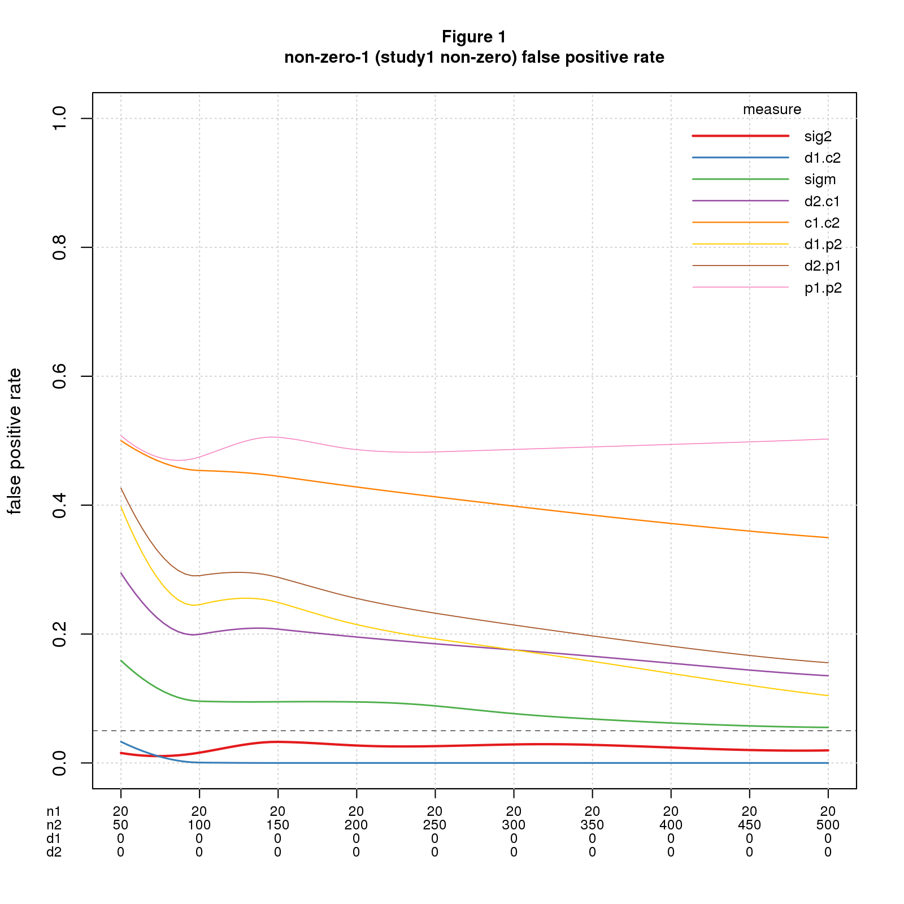;
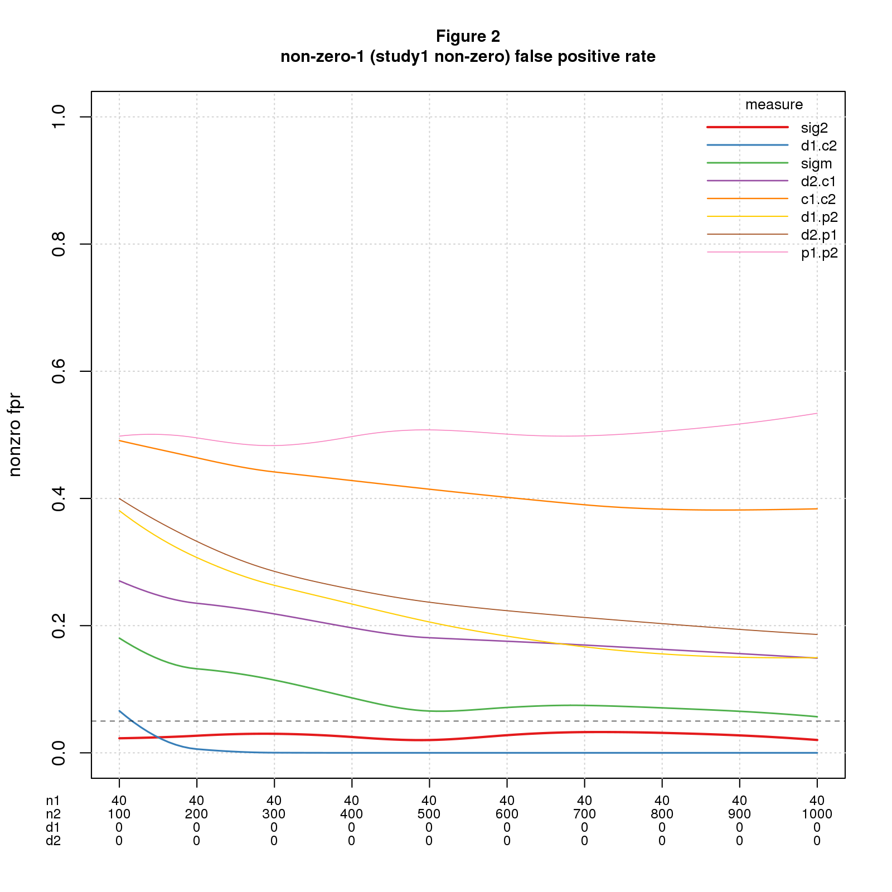;
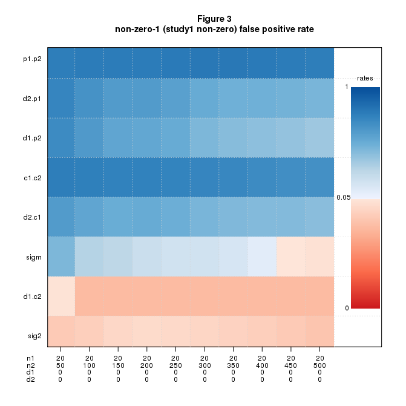;
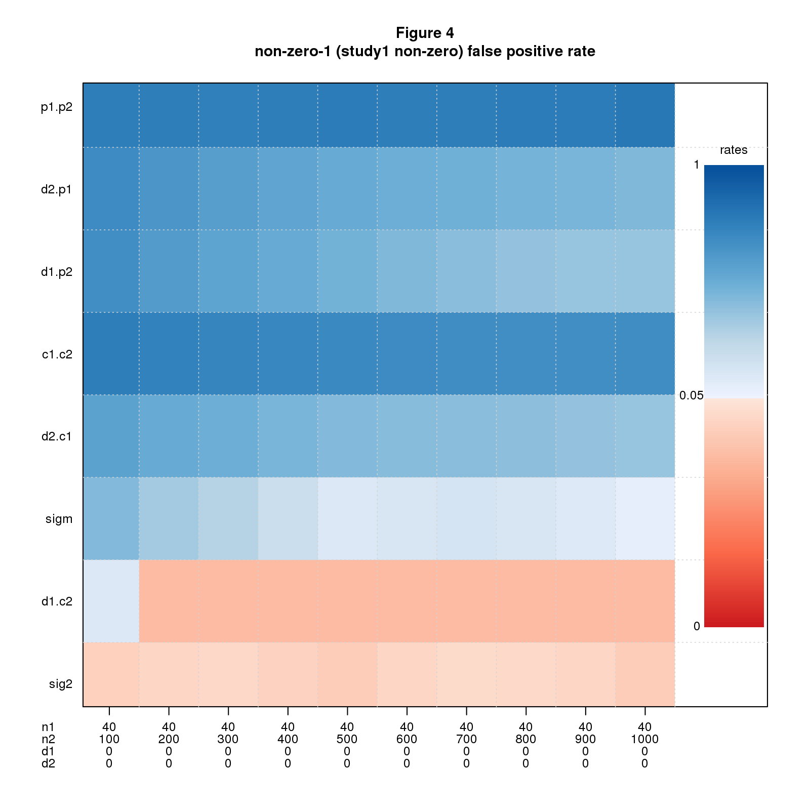;
```

The only measures with acceptable false positive rates across most of the parameter range are *sig2* and *d1.c2*.

Plotting false negatives is more tiresome, because we can also vary $d1_{pop}$ (and simultaneously $d2_{pop}$, of course). Figures 5-6 are heatmaps of false negative rates for the same range of $n1$, $n2$ (but with a coarser grid of $n2$ values) and for $d1_{pop}=d2_{pop}$ varying over $\{0.2, 0.5, 0.8\}$. Each heatmap shows all three values of $d_{pop}$; the dark vertical lines visually split each plot into separate "panels" for each $d_{pop}$. The red-to-blue transition is set at the conventionally accepted threshold of 0.20 for false negatives.

```{r out.width="50%",echo=FALSE,fig.show='asis'}
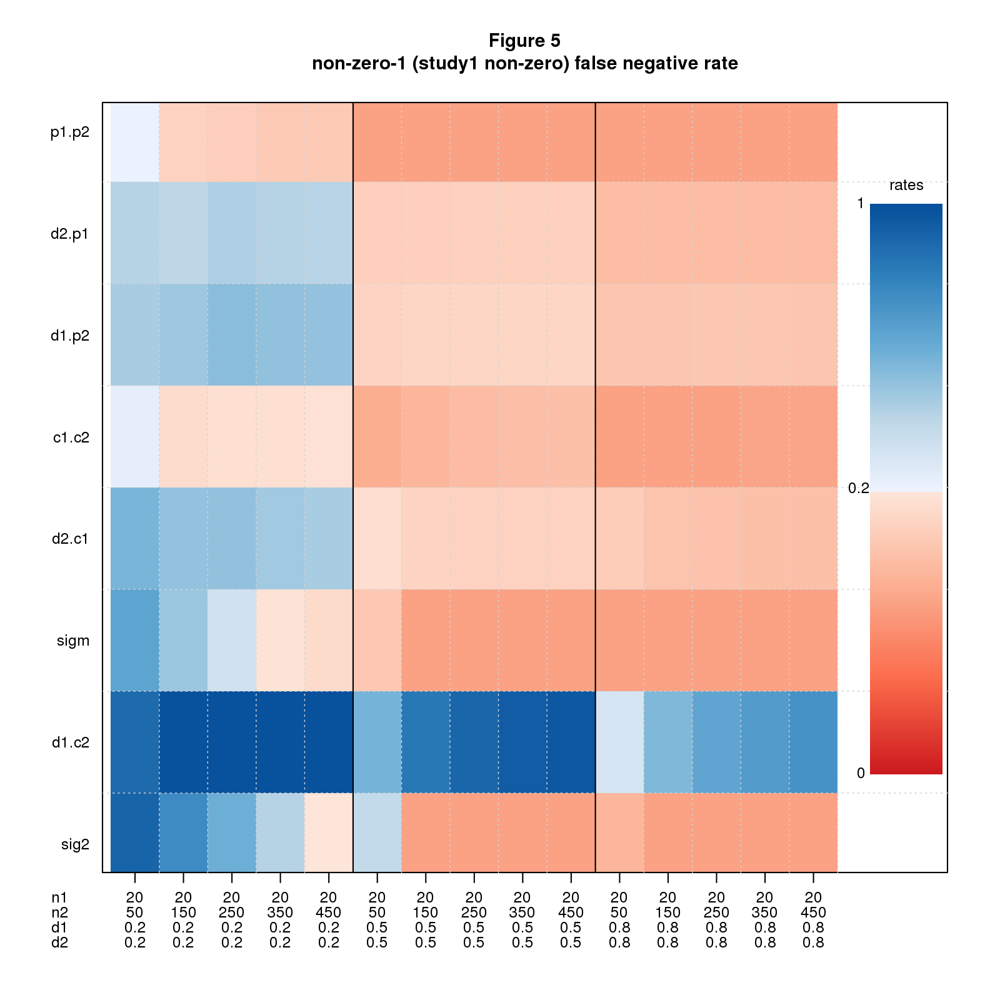;
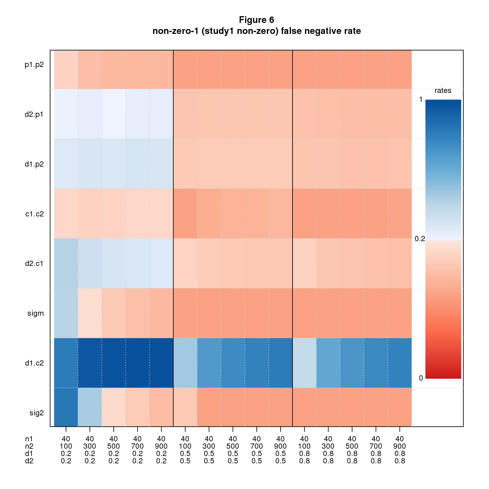;
```

As one would expect, performance improves as sample and effect sizes grow. The heatmaps for the larger sizes show a lot of red, telling us that many measures have acceptable false negative rates under these conditions.

For a measure to be usable, both error rates must be acceptable.  Let's compare the heatmaps for false positives and false negatives - figures 3-4 and 5-6. The only measure that is mostly red across all four figures is *sig2*; *d1.c2*, which looked good for false positives, is consistently bad for false negatives.

So far so good, but I've only shown data for a few values of $n1$. To see more conditions, I use a *rate-vs-rate* plot, inspired by *receiver operating characteristic (ROC)* curves, to  plot false negative vs. false positive rates for a large range of conditions.  See figure 7. The data in this figure extends the cases shown above: $n1$ varies from 20-160 in steps of 20, $n2$ is $2.5\ or\ 5 \times n1$, $d1_{pop}$ and $d2_{pop}$ range from 0 to 1 in steps of 0.1 with the constraint $d1_{pop}=d2_{pop}$. Each point shows the mean false negative vs. mean false positive rate for these conditions grouped by $n1,n2$. The rationale for grouping by $n1,n2$ is they are the only observable parameters. The dashed lines demark the conventionally acceptable error rates: 0.05 for false positives and 0.2 for false negatives; the bottom left hand corner is the region where both error rates are acceptable. 

```{r out.width="50%",echo=FALSE,fig.show='asis'}
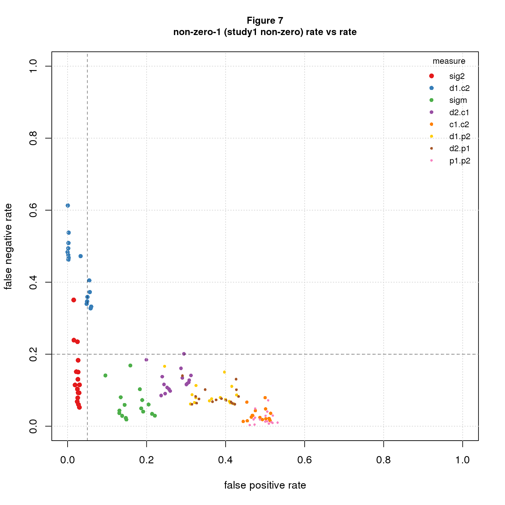;
```

The message clear: *sig2* is the only measure with points falling in the acceptable range. 

Boiling it down: for exact replications, *sig2* is the only game in town. Its false positive rate is the significance level divided by 2 (the factor of 2 because it's one-sided). The false negative rate is $1-power$ (the correlation of these statistics across the entire dataset is 0.99, data not shown). 

```{r eval=FALSE,include=FALSE}
source("script/repwr.R");
drat=data_rate(rate.rule='nonzro',xdata=expand.grid(n1=n,n2=n,d1=d,d2=d),mesr=cq(sig2))
drat.exact=subset(drat,subset=d1==d2)
drat.f=subset(drat.exact,subset=!true.dd)
drat.t=subset(drat.exact,subset=true.dd)
drat.t$power=with(drat.t,power.t.test(n=n2,delta=d2)$power)
with(drat.t,plot(sig2,power,pch=16,cex=0.75))
abline(a=0,b=1,lty='dashed')
with(drat.t,cor(sig2,power))
```

#### Inexact replications

For inexact replications there are more cases to consider since $d1_{pop}$ and $d2_{pop}$ can vary independently. I'll jump straight to rate-vs-rate plots to cover the ground succinctly using the same values of $n1$ and $n2$ as above, namely, $n1$ varies from 20-160 in steps of 20, and $n2$ is $2.5\ or\ 5 \times n1$.

Figures 8 shows the results: error rates are dreary in all conditions.

```{r out.width="50%",echo=FALSE,fig.show='asis'}
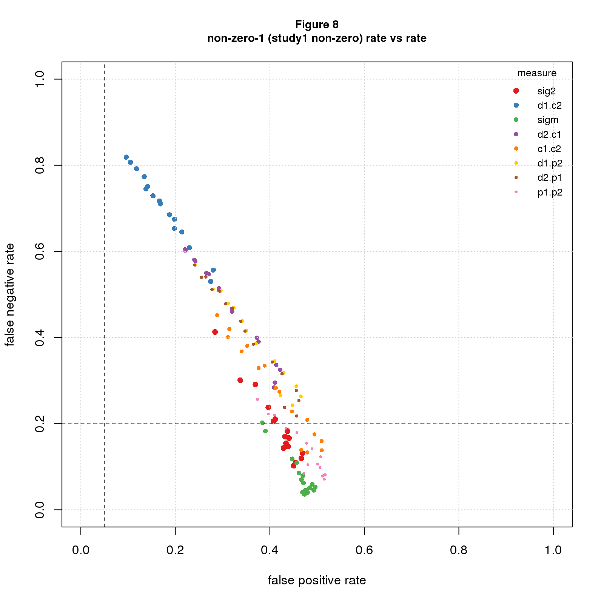;
```

#### Near exact replications

It may seem odd that *sig2* works fine for *non-zero* in exact replications but so poorly in inexact ones.  What if we try *near exact replications*, ones where $d1_{pop}$ and $d2_{pop}$ differ slightly? Figure 9 shows the results for nearness ranging from *exact* to fully *inexact* with steps in between. The figure is a rate-vs-rate plot that shows a single measure (*sig2*) across the various nearness values.

The results are discouraging. It doesn't take much separation to exceed acceptable error rates. When $d1_{pop}$ and $d2_{pop}$ differ by as little as 0.05, about half the points lie beyond the acceptable 0.05 false positive rate; by time we get to 0.2, all points are bad.

What's going on is a consequence of power. The data in the rate-vs-rate plots vary $n2$ from 50 to 800. With $d2_{pop}=0.05$, *sig2* has 12% power at $n2=500$ and 17% at $n2=800$.  This is anemic from the usual power standpoint but is plenty to drive *sig2*'s false positive rate beyond 0.05. Figure 10 illustrates the point by graphing *sig2*'s mean false positive rate grouped by $n2$ vs. $n2$. False positive rate is fine across the whole graph for *exact*  and until $n2>400$ or so for $nearness=0.05$, but quickly exceeds the acceptable error threshold for larger separations.

```{r out.width="50%",echo=FALSE,fig.show='asis'}
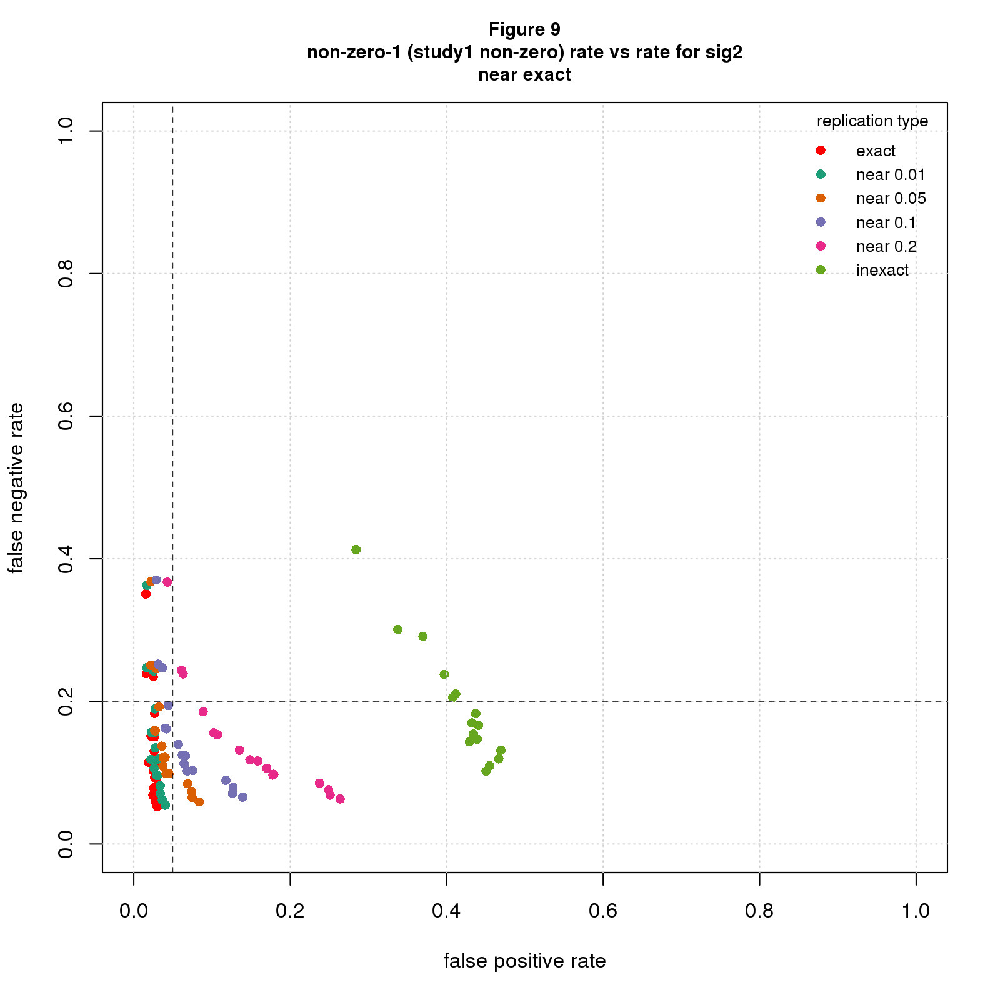;
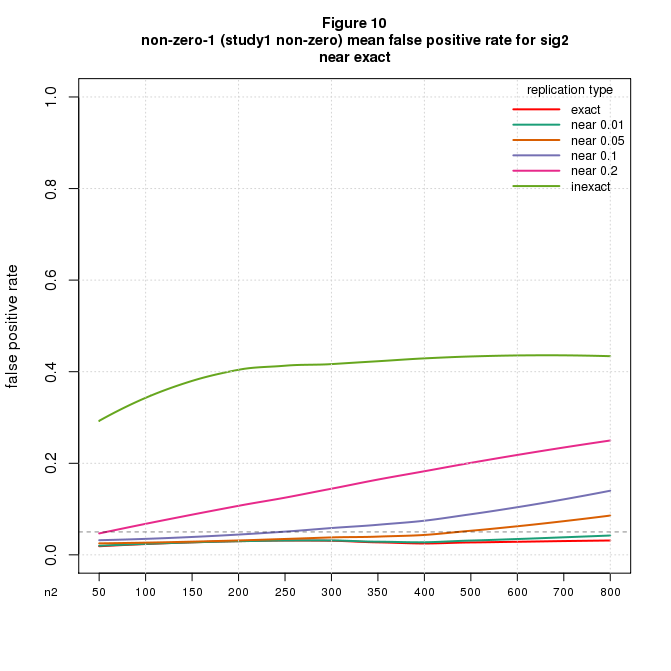;
```

### Replication used to check effect size

I now turn to the second correctness criterion, *same-effect*, which tests whether the population effect sizes of the replica and original studies are similar. Figures 11-14 show rate-vs-rate plots for two values of $\epsilon$ (0.1 or 0.5), and for fully inexact replications (figures 11-12) and assuming $d2_{pop} \le d1_{pop}$ (figures 13-14). The rationale for showing $\epsilon=0.1$ is this is the largest nearness value with any acceptable points in the *non-zero* analysis; the rationale for $\epsilon=0.5$ is this is the difference between *small* and *large* effect sizes in *Cohen's d* terminology. The assumption $d2_{pop} \le d1_{pop}$ reflects the view that investigators, consciously or not, tend to do original studies with populations that best exhibit the phenomenon of interest  

```{r out.width="50%",echo=FALSE,fig.show='asis'}
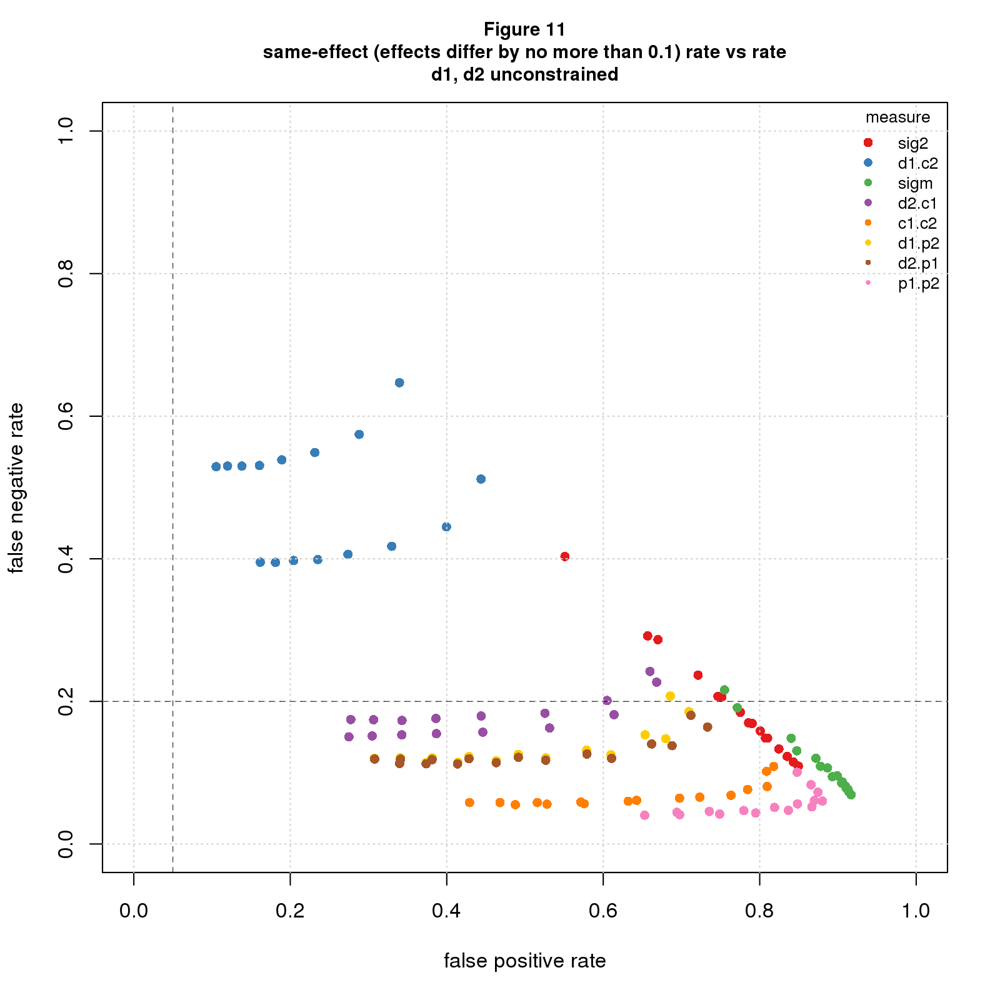;
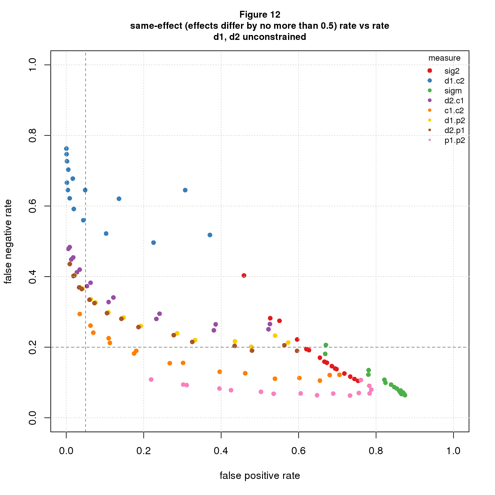;
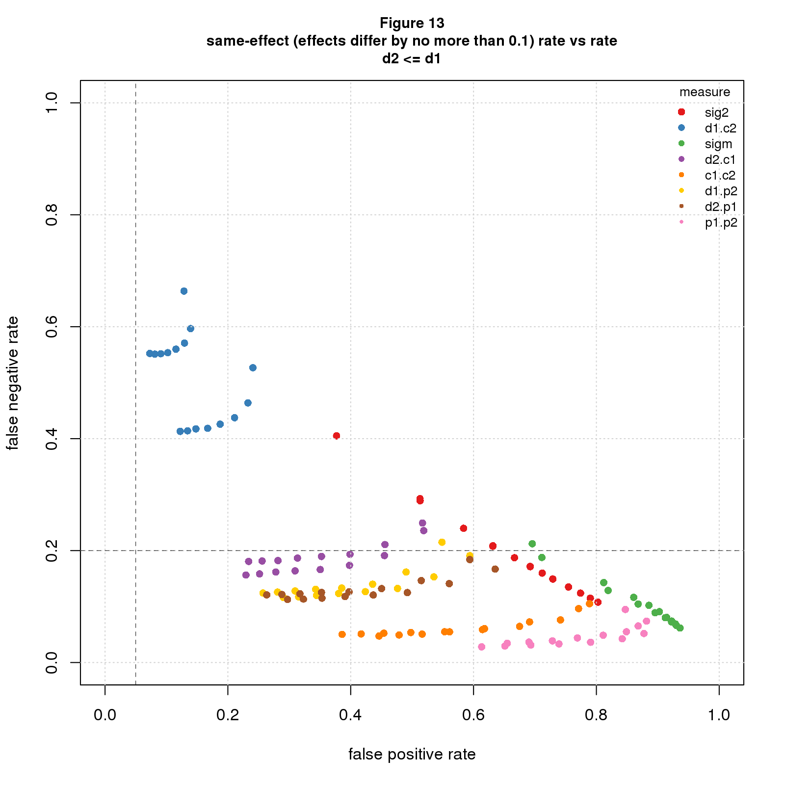;
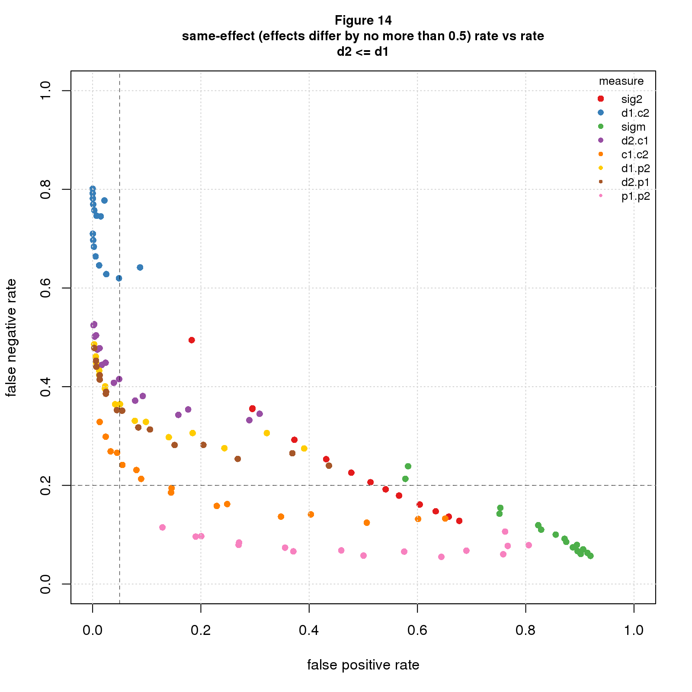;
```

The results are bad in all cases. Error rates are better for $\epsilon=0.5$ and with $d2_{pop} \le d1_{pop}$ but not enough.

### Small telescopes

Uri Simonsohn's *small telescopes* method combines both correctness criteria in a single test. In my notation, *d2.scp1* is positive if

1. *sig2* is positive (presumably to test *non-zero*) and 
2. $d2_{sdz}$, the replica's observed effect size, exceeds a threshold deemed to be the smallest effect size likely to be observed if *same-effect* is true.

Figures 15-18 compare *sig2* and *d2.scp1* for the two correctness criteria.  The figures reuse conditions from previous sections: for *non-zero*, I use nearness of 0.1; for *same-effect*, I use $\epsilon=0.5$ and with $d2_{pop} \le d1_{pop}$. Figures 15 and 17 are rate-vs-rate plots; figures 16 and 18 show the same data as aggregate line graphs. 

```{r out.width="50%",echo=FALSE,fig.show='asis'}
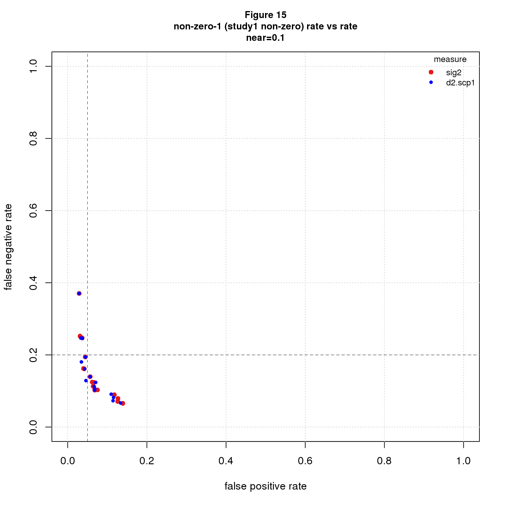;
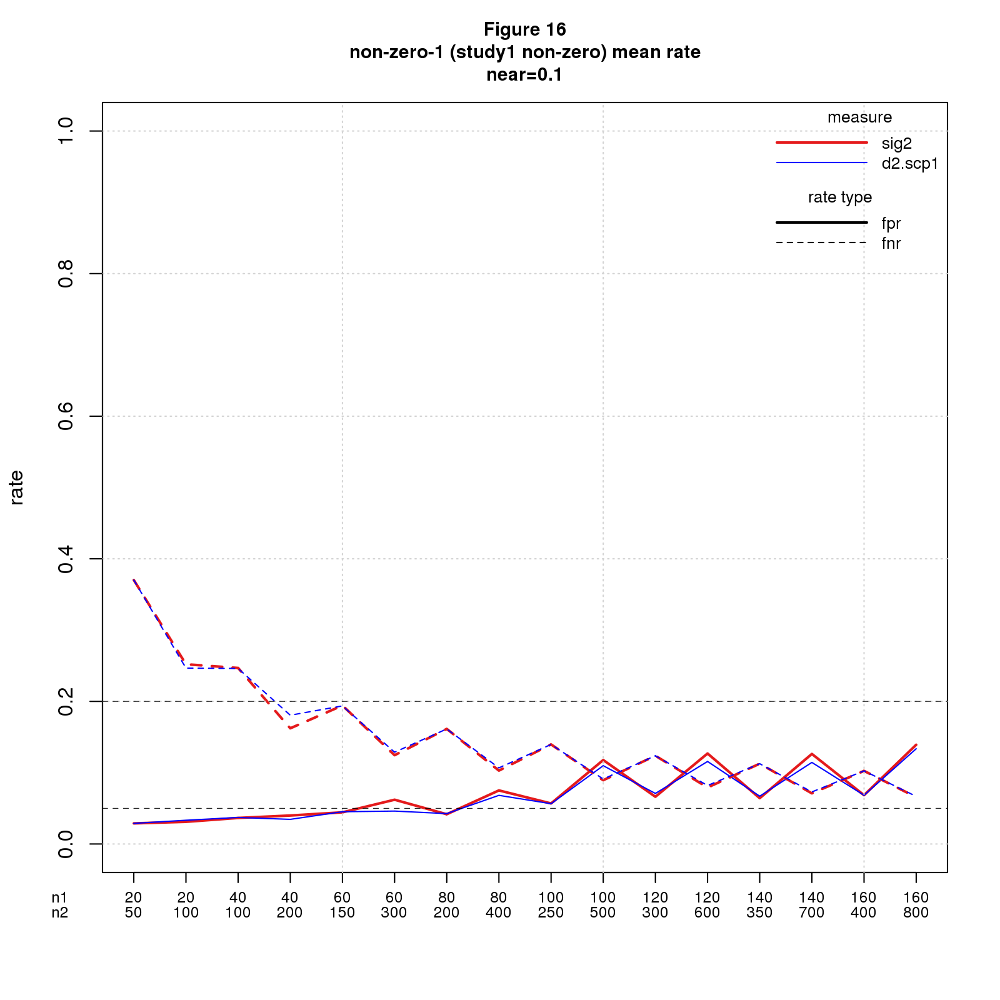;
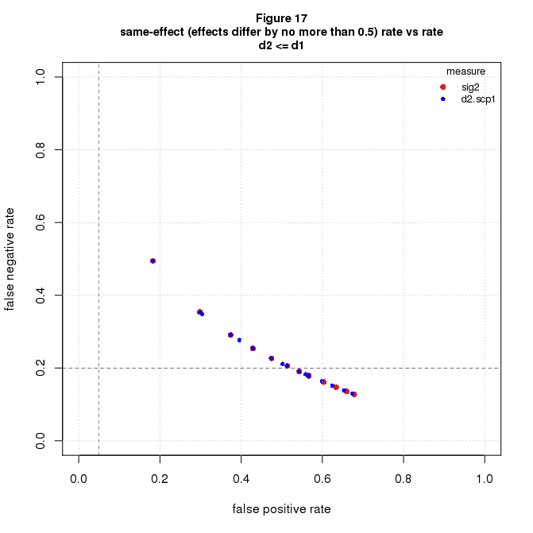;
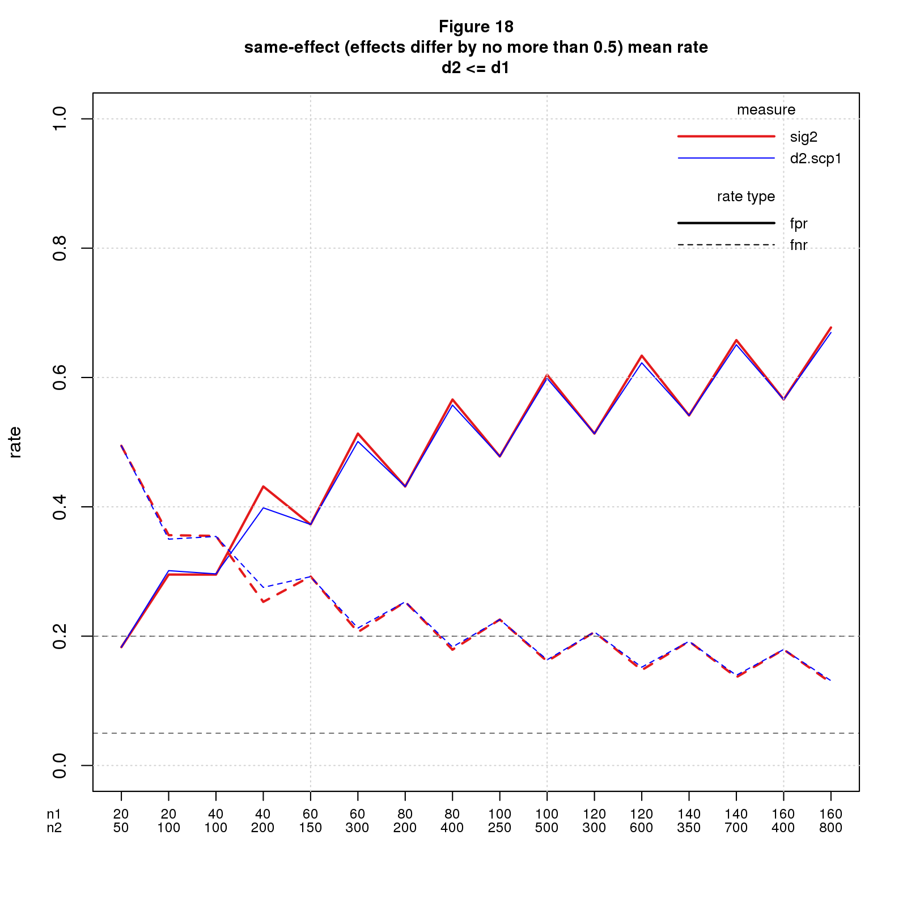;
```

The differences are very small: *small telescopes* has almost no effect over and above *sig2*.

## Discussion

Systematic replication is a poor statistical test. It works as a validation test only when the original and replica studies are sampling nearly identical populations. Methods for testing whether the populations are similar work poorly under all conditions analyzed.

These dismal results are not surprising once we examine replication in a statistical testing framework. When used for validation, we're drawing inferences about the original study from properties of the replica; it stands to reason this will only work if the two studies are very similar. When used to compare the two populations, we're trying to accurately estimate the difference between two population effect sizes, a problem known to require very large samples - $n>3000$ by [Uri Simonsohn's calculations](http://datacolada.org/20). 

I see several ways my results might be wrong.  Perhaps I defined the wrong correctness criteria, or set the error thresholds too low, or analyzed the wrong conditions. I assumed throughout that all population effect sizes were equally likely within the range studied; in particular, I didn't consider *publication bias* which may make smaller effect sizes more likely. Nor did I take into account the prior probability that studies are true which may cause p-values to underestimate the probability of false positives. Perhaps a more nuanced distribution would improve the results.  The ever-present danger of software bugs also lurks. If you see a mistake, please let me know and I'll try to fix.

If correct, my results suggest that systematic replication projects need to change goals or methods.  If the goal remains validation, it's essential that each replica closely match its original study.  This bodes ill for large, systematic replication efforts, which typically prioritize uniformity over fidelity to run lots of studies at reasonable cost. 

An alternative is to switch gears and focus on generalizability. This would change the mindset of replication researchers more than the actual work. Instead of trying to refute a study, you would assume the study is correct within the limited setting of the original investigation and try to extend it to other settings. The scientific challenge becomes defining good "other settings" - presumably there are many sensible choices -- and selecting studies that are a good fit for each. This seems a worthy problem in its own right that will move the field forward no matter how many original studies successfully generalize.

## Comments Please!

Please post comments on [Twitter](https://twitter.com/gnatgoodman) or [Facebook](https://www.facebook.com/nathan.goodman.3367), or contact me by email [natg@shore.net](mailto:natg@shore.net).
