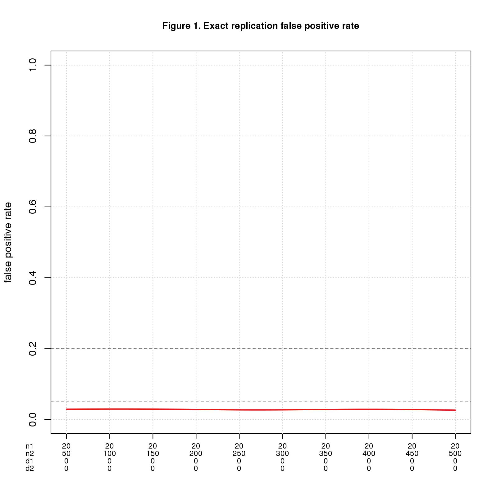
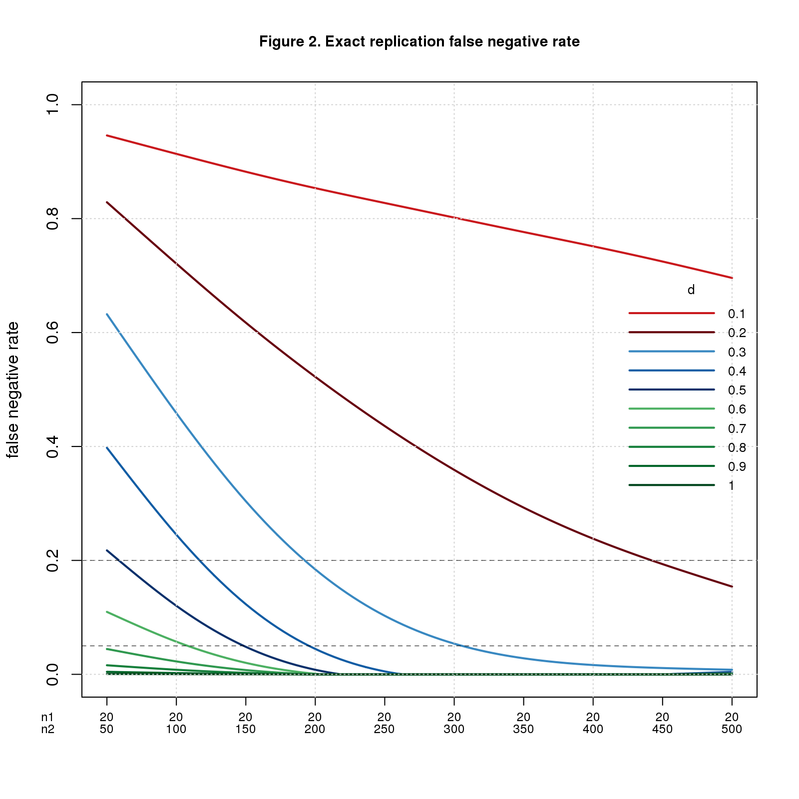
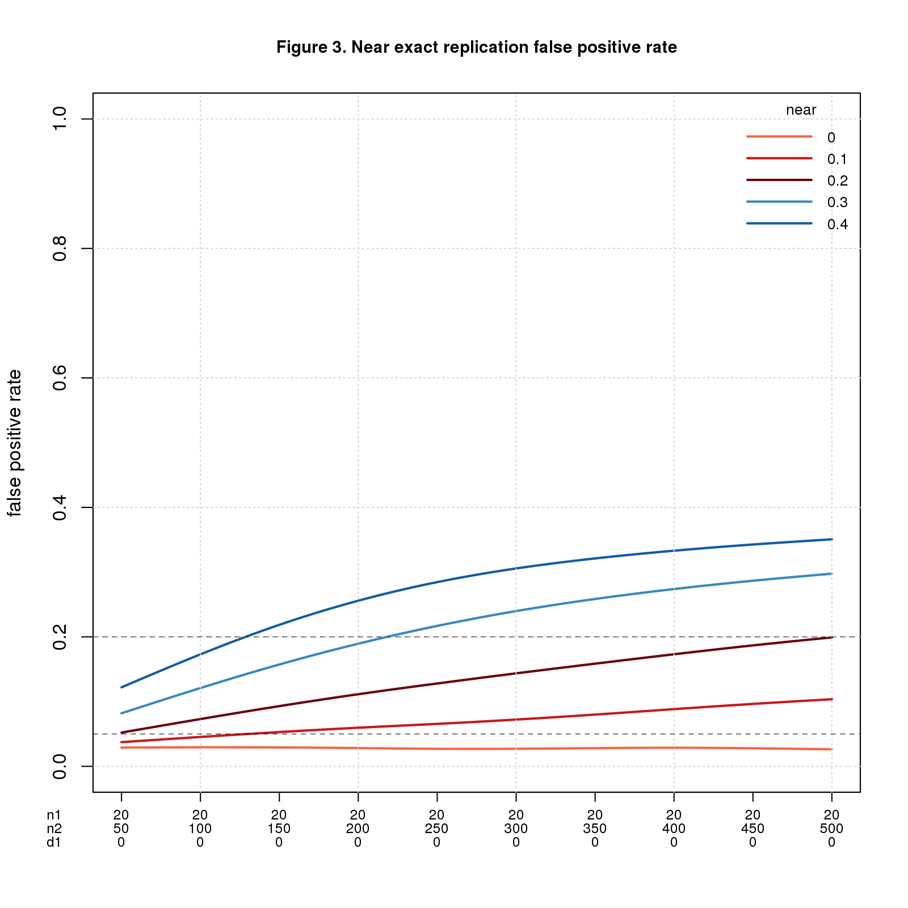
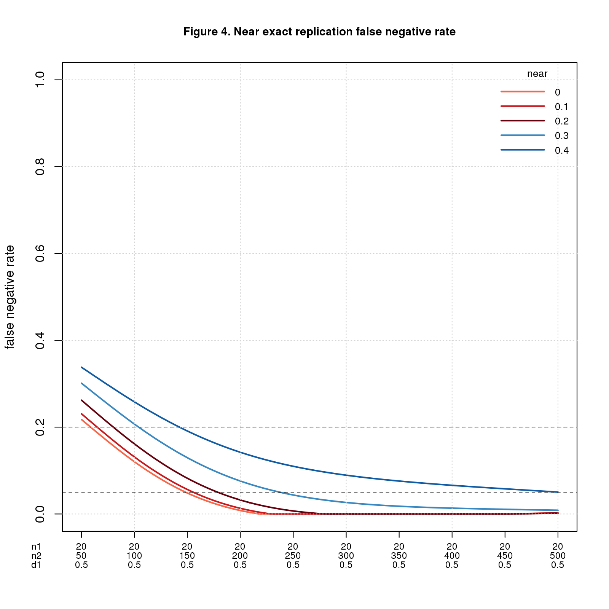
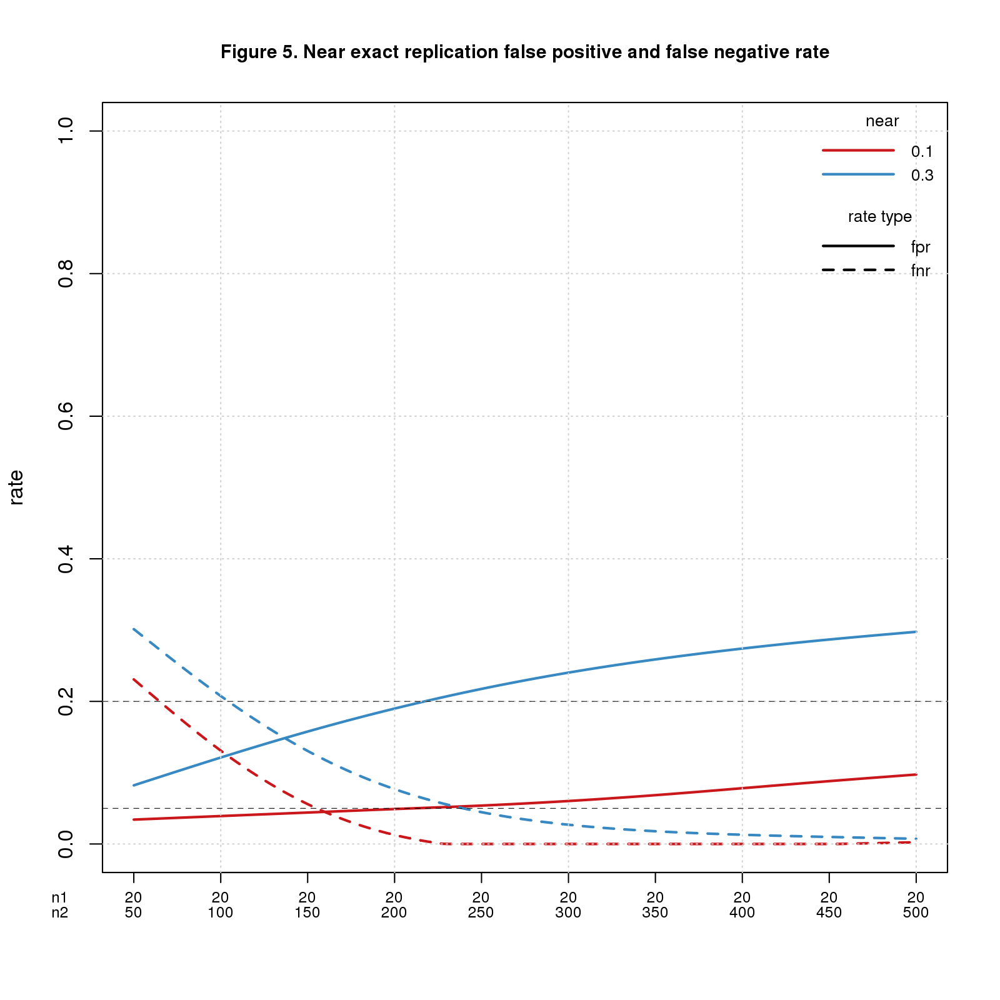

*Replication seems a sensible way to assess whether a scientific result is right. The intuition is clear: if a result is right, you should get a significant result when repeating the work; if it it's wrong, the result should be non-significant. I test this intuition across a range of conditions using simulation. For exact replications, the intuition is dead on, but when replicas diverge from the original studies, error rates increase rapidly. Even for the exact case, false negative rates are high for small effects unless the samples are large. These results bode ill for large, systematic replication efforts, which typically prioritize uniformity over fidelity and limit sample sizes to run lots of studies at reasonable cost.*

## Introduction

The basic replication rationale goes something like this: (1) many published papers are wrong; (2) this is a serious problem the community must fix; and (3) systematic replication is an effective solution. (In recent months, I've seen an uptick in pre-registration as another solution. That's a topic for another day.)  In this post, I focus on the third point and ask: viewed as a statistical test, how well does systematic replication work; how well does it tell the difference between valid and invalid results?

By "systematic replication" I mean projects like 
[Many Lab](https://osf.io/89vqh/),
[Reproducibility Project: Psychology (RPP)](https://osf.io/ezcuj/wiki/home),
[Experimental Economics Replication Project (EERP)](https://experimentaleconreplications.com), and
[Social Sciences Replication Project (SSRP)](http://www.socialsciencesreplicationproject.com)
that systematically select studies in a particular field and repeat them in a uniform fashion. The main publications for these projects are 
[Many Lab](https://econtent.hogrefe.com/doi/full/10.1027/1864-9335/a000178), 
[RPP](http://science.sciencemag.org/content/349/6251/aac4716),
[EERP](http://science.sciencemag.org/content/early/2016/03/02/science.aaf0918.full),
[SSRP](https://www.nature.com/articles/s41562-018-0399-z).

I consider a basic replication scheme in which each original study is repeated once. This is like [RPP](https://osf.io/ezcuj/wiki/home) and [EERP](https://experimentaleconreplications.com), but unlike [Many Lab](https://osf.io/89vqh/) as published which repeated each study 36 times and [SSRP](http://www.socialsciencesreplicationproject.com) which used a two-stage replication strategy. 
I imagine that the replicators are trying to closely match the original study (*direct replication*) while doing the replications in a uniform fashion for cost and logistical reasons.

My test for replication success is the same as SSRP (what they call the *statistical significance criterion*): a replication succeeds if the replica has a significant effect in the same direction as the original.

A replication is *exact* if the two studies are sampling the same population. This is an obvious replication scenario. You have a study you think may be wrong; to check it out, you repeat the study, taking care to ensure that the replica closely matches the original. Think [cold fusion](https://en.wikipedia.org/wiki/Cold_fusion). A replication is *near-exact* if the populations differ slightly. This is probably what systematic replication achieves, since the need for uniformity reduces precision.

Significance testing of the replica (more precisely, the statistical significance criterion) works as expected for exact replications, but error rates increase rapidly as the populations diverge. Under conditions that may be typical in systematic replication projects, the rate of false positive mistakes ranges from 1-71% and false negative mistakes from 0-85%. This enormous range results from the cumulative effect of multiple unknown, hard-to-estimate parameters. My results suggest that we should adjust our expectations for systematic replication projects. These projects may make a lot of mistakes; we should take their replication failure rates with a grain of salt.

The software supporting this post is open source and freely available in [GitHub](https://github.com/natgoodman/repwr).

## Scenario and Nomenclature

The software simulates *studies* across a range of conditions then combines pairs of studies into *pairwise replications*. The first study of each pair is the *original* and the second the *replica*. Four variables parameterize each pairwise replication: $n1$, $n2$, $d1_{pop}$, $d2_{pop}$. These are the sample and population effect sizes for the two studies.

The studies are simple two group comparisons parameterized by sample size $n$ and population effect size $d_{pop}$ ($d_{pop}\ge0$). For each study, I generate two groups of $n$ random numbers. One group comes from a standard normal distribution with $mean=0$; the other is standard normal with $mean=d_{pop}$. I then calculate basic statistics, most notably the *standardized observed effect size*, $d_{sdz}$, aka *Cohen’s d*, and the p-value from a t-test, *pval*.

I simulate 14,641 conditions each with $10^4$ simulated replications, for a total of almost 150 million simulated instances.  When analyzing results, I interpolate to get values not simulated directly.

An important limitation is that I assume that all population effect sizes are equally likely within the range studied. I don't consider *publication bias* which may make smaller effect sizes more likely, or any prior knowledge of expected effect sizes.

To reduce confusion, I try to use consistent terminology.

- *true* and *false* refer to the correct answers. A *true replication* is one where the original study is valid, i.e.,  $d1_{pop}\ne0$; a *false replication* is one where $d1_{pop}=0$
- *positive* and *negative* refer to the results of the replication test. A *positive replication* is one for which the replica has a significant p-value and effect size in the same direction as the original; a *negative instance* is the opposite. Obviously the distinction between positive and negative depends on the chosen significance level. To keep things simple, I always use the conventionally accepted significance threshold of $0.05$
- a *false positive replication* is one where the original study is invalid, yet the replica passes the test
- a *false negative replication* is one where the original study is valid, yet the replica fails the test

I calculate *false positive* and *false negative rates* (abbr. *FPR* and *FNR*) relative to the number of replications in which the original study is significant. 

To get "mistake rates" I need one more parameter: $prop.true$, the proportion of replications that are true. This is the issue raised in  Ioannidis’s famous paper, [“Why most published research findings are false”](http://dx.plos.org/10.1371/journal.pmed.0020124) and many other papers and blog posts including [one by me](http://daniellakens.blogspot.nl/2017/10/science-wise-false-discovery-rate-does.html). The terminology for "mistake rates" varies by author. I use terminology adapted from [Jager and Leek's  paper](http://doi.org/10.1093/biostatistics/kxt007).

- *replication-wise false positive rate* (RWFPR) is the fraction of positive results that are false positives
- *replication-wise false negative rate* (RWFNR) is the fraction of negative results that are false negatives

## Results

### Exact replications

A replication is *exact* if the two studies are sampling the same population; this means $d1_{pop}=d2_{pop}$.

Figure 1 shows FPR for $n1=20$ and $n2$ varying from 50 to 500. The x-axis shows all four parameters using $d1$, $d2$ as shorthand for $d1_{pop}$, $d2_{pop}$. $d1_{pop}=d2_{pop}=0$ throughout because this is the only way to get false positives with exact replications. Figure 2 shows FNR for the same values of $n1$ and $n2$ but with $d1_{pop}=d2_{pop}$ ranging from 0.1 to 1. 

I mark the conventionally accepted thresholds for false positive and negative error rates (0.05 and 0.2, resp.) as known landmarks to help interpret the results. I do **not** claim that these are the right thresholds for replications.

```{r out.width="50%",echo=FALSE,fig.show='asis'}
;
;
```

For this ideal case, replication works exactly as intuition predicts. FPR is the significance level divided by 2 (the factor of 2 because the effect sizes must have the same direction). Theory tell us that $FNR=1-power$ and though not obvious from the graph, the simulated data agrees well. 

As one would expect, if the population effect size is small, $n2$ must be large to reliably yield a positive result. For $d=0.2$, $n2$ must be almost 400 in theory and 442 in the simulation to achieve $FNR=0.2$; to hit $FNR=0.05$, $n2$ must be more than 650 (in theory). These seem like big numbers for a systematic replication project that needs to run many studies.

### Near exact replications

A replication is *near-exact* if the populations differ slightly, which means $d1_{pop}$ and $d2_{pop}$ differ by a small amount, $near$; technically $abs(d1_{pop}-d2_{pop})\le near$.

I don't know what value of $near$ is reasonable for a systematic replication project. I imagine it varies by research area depending on the technical difficulty of the experiments and the variability of the phenomena. The range 0.1-0.3 feels reasonable. The figures extend the range by 0.1 on each end just to be safe.

Figure 3 uses the same values of $n1$, $n2$, and $d1_{pop}$ as in Figure 1. Figure 4 has the same parameters but fixes $d1_{pop}=0.5$, a medium effect size. Both include $near$ ranging from 0 to 0.4. In these figures, $d2_{pop}$ ranges from $d1_{pop}-near$ to $d1_{pop}+near$ with values $<0$ or $>1$ discarded.


```{r out.width="50%",echo=FALSE,fig.show='asis'}
;
;
```

FPR is fine when $n2$ is small, esp. when $near$ is also small, but gets worse as $n2$ (and $near$) increase. It may seem odd that the error rate increases as the sample size increases. What's going on is a consequence of power. More power is usually good, but in this setting every positive is a false positive, so more power is bad. FNR behaves in the opposite direction: bad when $n2$ is small and better as $n2$ increases. 

To show the tradeoff between FPR and FNR, Figure 5 plots both error rates for $near=0.1$ and $near=0.3$. 

```{r out.width="50%",echo=FALSE,fig.show='asis'}
;
```

For $near=0.1$, $n2=150$ is a sweet spot with both error rates about 0.05. For $near=0.3$, the crossover point is $n2=137$ with error rates of about 0.15. 

FNR also depends on $d1_{pop}$, getting worse when $d1_{pop}$ is smaller and better when $d1_{pop}$ is bigger. The table below shows the error rates for a few values of $n2$, $near$, and $d1_{pop}$. Note that FPR only depends on $n2$ and $near$, while FNR depends on all three parameters. The FNR columns are for different values of $d1_{pop}$.

| n2    | near  | FPR   | FNR 0.2 | FNR 0.5 | FNR 0.8 |
| :---: | :---: | :---: | :----: | :---: | :---: |
| 150 | 0.1 | 0.05 | 0.61 | 0.06 | 0.00 |
| 150 | 0.3 | 0.16 | 0.50 | 0.13 | 0.01 |
| 300 | 0.1 | 0.07 | 0.39 | 0.00 | 0.00 |
| 300 | 0.3 | 0.24 | 0.36 | 0.03 | 0.00 |
| 450 | 0.1 | 0.10 | 0.26 | 0.00 | 0.00 |
| 450 | 0.3 | 0.29 | 0.31 | 0.01 | 0.00 |

FNR is great for $d1_{pop}=0.8$, mostly fine for $d1_{pop}=0.5$, and bad for $d1_{pop}=0.2$. Pushing up $n2$ helps but even when $n2=450$, FNR is probably unacceptable for $d1_{pop}=0.2$. Increasing $n2$ worsens FPR. It seems the crossover point above, $n2=137$, is about right. Rounding up to 150 seems a reasonable rule-of-thumb.

### Replication-wise error rates

The error rates reported so far depend on the truth status of the replication: *true* for FPR. *false* for FNR. The next step is to convert these into replication-wise error rates: RWFPR and RWFNR. To do so, we need one more parameter: $prop.true$, the proportion of replications that are true. 

Of course, we don't know the value of $prop.true$; arguably it's the most important parameter that systematic replication projects are trying to estimate. Like $near$, it probably varies by research field and may also depend on the quality of the investigator. Some authors assume $prop.true=0.5$, but I see little evidence to support any particular value.  It's easy enough to run a range of values and see how $prop.true$ affects the error rates.

The table below shows the results for $n2=150$, $near=0.1,0.3$ as above, and $prop.true$ ranging from 0.1 to 0.9. The RWFPR and RWFNR columns are for different values of $d1_{pop}$.

| n2    | near  | prop.true | RWFPR 0.2 | RWFPR 0.5 | RWFPR 0.8 | RWFNR 0.2 | RWFNR 0.5 | RWFNR 0.8 |
| :---: | :---: | :-------: | :------: | :------: | :------: | :------: | :------: | :------: |
| 150 | 0.1 | 0.10 | 0.55 | 0.34 | 0.32 | 0.07 | 0.01 | 0.00 |
| 150 | 0.1 | 0.25 | 0.29 | 0.14 | 0.14 | 0.18 | 0.02 | 0.00 |
| 150 | 0.1 | 0.50 | 0.12 | 0.05 | 0.05 | 0.39 | 0.06 | 0.00 |
| 150 | 0.1 | 0.75 | 0.04 | 0.02 | 0.02 | 0.66 | 0.15 | 0.01 |
| 150 | 0.1 | 0.90 | 0.01 | 0.01 | 0.01 | 0.85 | 0.35 | 0.03 |
| 150 | 0.3 | 0.10 | 0.74 | 0.62 | 0.59 | 0.06 | 0.02 | 0.00 |
| 150 | 0.3 | 0.25 | 0.49 | 0.35 | 0.32 | 0.17 | 0.05 | 0.00 |
| 150 | 0.3 | 0.50 | 0.24 | 0.15 | 0.14 | 0.37 | 0.13 | 0.01 |
| 150 | 0.3 | 0.75 | 0.10 | 0.06 | 0.05 | 0.64 | 0.32 | 0.04 |
| 150 | 0.3 | 0.90 | 0.03 | 0.02 | 0.02 | 0.84 | 0.58 | 0.10 |

Check out the top and bottom rows. The top row depicts a scenario where most replications are false ($prop.true=0.1$) and the replicas closely match the original studies ($near=0.1$); for this case, most positives are mistakes and most negatives are accurate. The bottom row is a case where most replications are true ($prop.true=0.9$) and the replicas diverge from the originals ($near=0.3$); here most positives are correct and, unless $d1_{pop}$ is large, most negatives are mistakes. 

Which scenario is realistic? There are plenty of opinions but scant evidence. Your guess is as good as mine. 

## Discussion

Systematic replication is a poor statistical test. Replication works well when care is taken to ensure the replica closely matches the original study. This is the norm in focused, one-off replication studies aiming to confirm or refute a single finding. It seems unrealistic in systematic replication projects, which typically prioritize uniformity over fidelity to run lots of studies at reasonable cost. If the studies differ as they almost certainly must in systematic projects, mistake rates grow and may be unacceptably high under many conditions.

My results suggest that systematic replication is unsuitable as a tool for validating existing studies. An alternative is to switch gears and focus on generalizability. This would change the mindset of replication researchers more than the actual work. Instead of trying to refute a study, you would assume the study is correct within the limited setting of the original investigation and try to extend it to other settings. The scientific challenge becomes defining good "other settings" - presumably there are many sensible choices -- and selecting studies that are a good fit for each. This seems a worthy problem in its own right that would move the field forward no matter how many original studies successfully generalize.

I’ve seen plenty of bad science up close and personal, but in my experience statistics isn't the main culprit. The big problem I see is faulty research methods. Every scientific field has accepted standard research methods. If the methods are bad, even "good" results are likely to be wrong; the results may be highly replicable but wrong nonetheless.

The quest to root out bad science is noble but ultimately futile. "Quixotic" comes to mind. Powerful economic forces shape the size and make-up of research areas. Inevitably some scientists are better researchers than others. But "Publish or Perish" demands that all scientists publish research papers. Those who can, publish good science; those who can't, do the best they can.

We will do more good by helping good scientists do good science than by trying to slow down the bad ones. The truly noble quest is to develop tools and techniques that make good scientists more productive. That's the best way to get more good science into the literature.  

## Comments Please!

Please post comments using the [GitHub Issue Tracker](https://github.com/natgoodman/repwr/issues).

