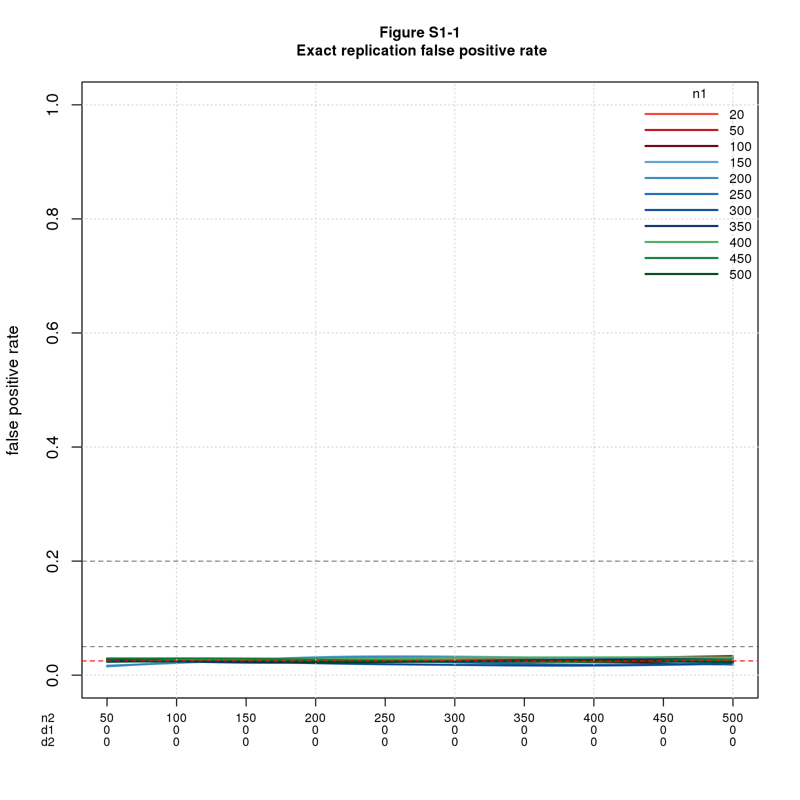

## Introduction

This document contains supplementary material for the blog post [Systematic Replication May Make Many Mistakes](https://replicationnetwork.com/2018/09/28/goodman-systematic-replication-may-make-many-mistakes/) kindly posted by Bob Reed on The Replication Network. It contains results that didn't fit in the blog post as published for reasons of space or pedagogy. It's not terribly coherent as a standalone document. Sorry.

## Results

### Exact replications

A replication is *exact* if the two studies are sampling the same population; this means $d1_{pop}=d2_{pop}$. For this ideal case, replication works as intuition predicts.

Theory tell us that FPR is the significance level divided by 2 (the factor of 2 because the effect sizes must have the same direction) and $FNR=1-power2$, where $power2$ is the power of the replica study. As we'll see, the simulated FPR is dead-on, but the simulated FNR is not as good, esp. when $n1$ and $d$ are small. The discrepancy is due to the same-direction requirment.

#### False positive rate

For this simple case, only two parameters vary: $n1$ and $n2$. The effect sizes are constant: $d1_{pop}=d2_{pop}=0$ throughout because this is the only way to get false positives with exact replications.

With only two parameters, I can show the whole picture in a single graph. Figure S1-1 shows FPR vs. $n1$ and $n2$, with $n2$ on the x-axis and different colored lines for $n1$. The lines fall on top of each other and are essentially constant illustrating that the sample sizes have no effect on the results. There's a dashed red horizontal line at $sig.level/2=0.025$ (just barely visible through the solid lines depicting FPR). The factor of 2 is due to requiring the effect sizes to have the same direction. Figure S1-2 confirms this explanation by replotting the results with the same-direction filter turned off.

```{r out.width="50%",echo=FALSE,fig.show='asis'}
;
;
```

#### False negative rate

For this case, three parameters vary: $n1$, $n2$, and $d=d1_{pop}=d2_{pop}$. 

Figure S2-1a is like Figure 2 in the blog post with the addition of dashed lines depicting $1-power2$ and with the legend moved down a smidge. It shows FNR for $n1=20$ and $n2$ varying from 50 to 500 (the same values as in Figure S1) but with $d1_{pop}=d2_{pop}$ ranging from 0.1 to 1. Figure S2-1b is the same but with $n1=200$. 

```{r out.width="50%",echo=FALSE,fig.show='asis'}
;
knitr::include_graphics('figure/resig/supp/m=1e4/figure_S02001b_exact_fnr_n1=200.png');
```

For $n1=20$ (Figure S2-1a), the simulated FNR is a bit greater than theory predicts when $d$ is small. For $n1=200$ (Figure S2-1b), the fit is good for all values of $d$: the dashed lines are mostly hidden by the solid ones.

I get worried when my simulated results differ consistently from theory, even when the discrepancy is small.  So I explored.  It turns out the difference is due to the same-direction requirement; when power is low, same-direction has a large enough effect to increase FNR noticeably. Figures S2-2a and S2-2b repeat the figures with same-direction switched off. Theory and simulation now agree quite well for both values of $n1$.

```{r out.width="50%",echo=FALSE,fig.show='asis'}
;
;
```

The correlation of FNR and $1-power2$ across the entire dataset is 0.9997737 and 0.9999019 resp. with same-direction on and off.  When limiting to small values of $d2_{pop}$, $d2_{pop}\le0.2$, the correlations are 0.9989049 and 0.9995707.

What about the full range of $n1$? Once we correct for same-direction, theory says that FNR is independent of $n1$. Figure S2-3a confirms this. It plots FNR vs. $n1$ and $n2$, with $n2$ on the x-axis, different colored lines for $n1$, and with FNR aggregated over $d$; this means that FNR as plotted is the $mean(FNR)$ over all non-zero values of $d$.

When I thought about it a little more, I wondered about the second order effect of $n1$ on the distribution of significant $d1_{pop}$. This matters because the only replicas that make it into the FNR calculation are ones where the original study was significant. Intuitively, when $n1$ is small, the distribution of significant $d1_{pop}$ should be shifted up, which in turn increases the chances that the replica will be significant, leading to smaller FNR. Figure S2-3b shows this effect. It seems this may be an important observaton, but I have not yet followed it up. 

```{r out.width="50%",echo=FALSE,fig.show='asis'}
;
;
```

#### Inexact replications

A replication is *inexact* if the two studies are sampling very different populations, meaning $d1_{pop}$ and $d2_{pop}$ can vary independently. This seems unreasonably pessimistic for a well-run replication project but serves to illustrate what happens as we vary the parameters.

Figures S3-1 (a-d) show FPR and FNR for two values of $n1$ (20, 200), $n2$ varying from 50 to 500, $d1_{pop}=0$ for the FPR plots and 0.5 (a medium effect size) for the FNR plots, and $d2_{pop}$ ranging from 0 to 1. 

```{r out.width="50%",echo=FALSE,fig.show='asis'}
;
;
;
;
```

The main point is that FPR and FNR vary in opposite directions. FPR is good for small values of $d2_{pop}$ and $n2$ and gets worse as $d2_{pop}$ and $n2$ increase. FNR is bad when $d2_{pop}$ and $n2$ are small and gets better as these parameters increase. This is the same behavior we saw in the main blog near-exact case. 

Another point is that the graphs for the two values of $n1$ (20, 200) are nearly identical. I checked the numbers driving the graphs to make sure I hadn't inadvertently used the same data for both cases; the data are similar but not exactly the same.

The opposing behavior of FPR and FNR as $n2$ changes is worrisome. It suggests that balancing the error rates may be tricky.

The next two figures plot FPR and FNR on the same graph for $n1=20$ (Figure S3-2a) and $n1=200$ (Figure S3-2b). $n2$ and $d1$ are the same as above: $n2$ varies from 50 to 500, $d1_{pop}=0$ for FPR and 0.5 for FNR. $d2_{pop}$ ranges from 0 to 1 but with some of the values omitted so the graph will be legible. 

```{r out.width="50%",echo=FALSE,fig.show='asis'}
;
;
```

So far so good, but I've only shown data for a few values of $d1$. To see more conditions, Figure S3-3 uses a *rate-vs-rate scatter plot*, inspired by *receiver operating characteristic (ROC)* curves, to plot false negative vs. false positive rates for a large range of conditions. The data in this figure extends the cases shown above by letting $d1_{pop}$ and $d2_{pop}$ vary across the entire range. Each point shows the mean false negative vs. mean false positive rate for these conditions grouped by $n1,n2$. The rationale for grouping by $n1,n2$ is they are the only observable parameters.

```{r out.width="50%",echo=FALSE,fig.show='asis'}
;
```

The figure shows the opposing behavior of FPR and FNR in stark terms.  For inexact replications, there seems little hope of balancing the error rates effectively.  Good thing this isn't a realistic scenario!

#### Near exact replications

A replication is *near-exact* if the populations differ slightly, which means $d1_{pop}$ and $d2_{pop}$ differ by a small amount, $near$; technically $abs(d1_{pop}-d2_{pop})\le near$.

Figures S4-1 (a-d) show FPR and FNR for two values of $n1$ (20, 200), $n2$ varying from 50 to 500, $d1_{pop}=0$ for the FPR plots and 0.5 (a medium effect size) for the FNR plots, and $near$ ranging from 0 to 1. In these figures, $d2_{pop}$ ranges from $d1_{pop}-near$ to $d1_{pop}+near$ with values $<0$ discarded.

```{r out.width="50%",echo=FALSE,fig.show='asis'}
;
;
;
;
```

As in the inexact case, FPR and FNR vary in opposite directions. FPR is good for small values of $near$ and $n2$ and gets worse as $near$ and $n2$ increase. FNR is bad when $near$ and $n2$ are small and gets better as these parameters increase. This is the same behavior we saw in the main blog near-exact case. Also, as in previous cases, the graphs for the two values of $n1$ (20, 200) are nearly identical. I checked the numbers to make sure I hadn't inadvertently used the same data for both cases; the data are similar but not exactly the same.

To show the tradeoff between FPR and FNR, Figures S4-2a and S4-2b plot both error rates on the same graph for the two values of $n1=20$.

```{r out.width="50%",echo=FALSE,fig.show='asis'}
;
;
```

Figure S4-3 plots false negative vs. false positive rates for a large range of conditions using a rate-vs-rate scatter plot. The data in this figure extends the cases shown above by letting $d1_{pop}$ and $near$ vary across the entire range. Each point shows the mean false negative vs. mean false positive rate for these conditions grouped by $n1,n2$. The rationale for grouping by $n1,n2$ is they are the only observable parameters.

```{r out.width="50%",echo=FALSE,fig.show='asis'}
;
```

As in the inexact case, the figure clearly shows the opposing behavior of FPR and FNR.  Unless $near$ is small, there seems little hope of balancing the error rates effectively.  

## Comments Please!

Please post comments using the [GitHub Issue Tracker](https://github.com/natgoodman/repwr/issues).

